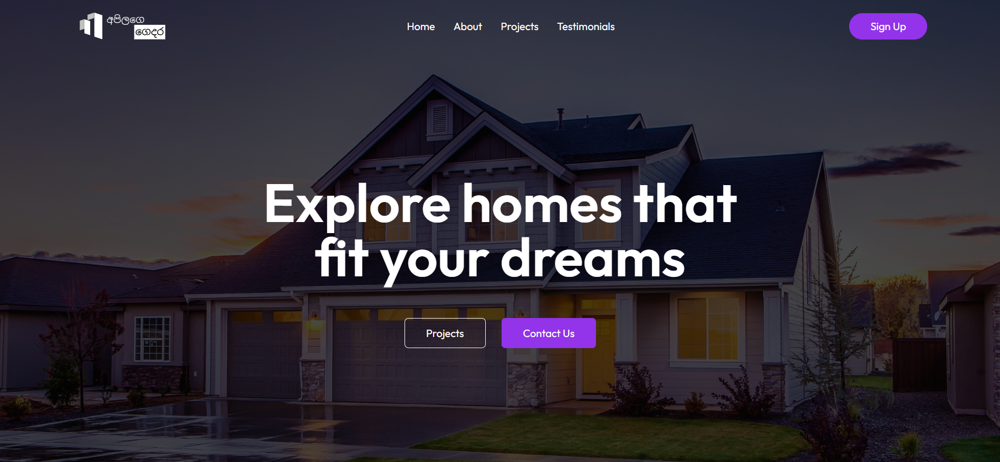
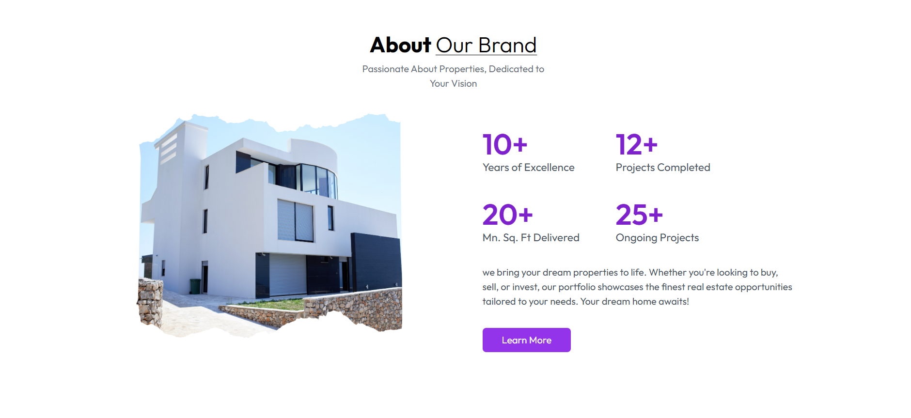
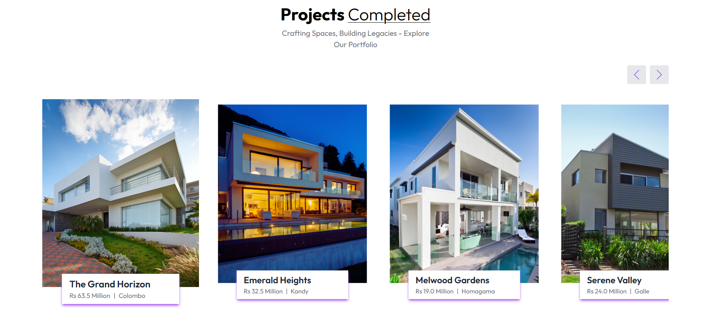
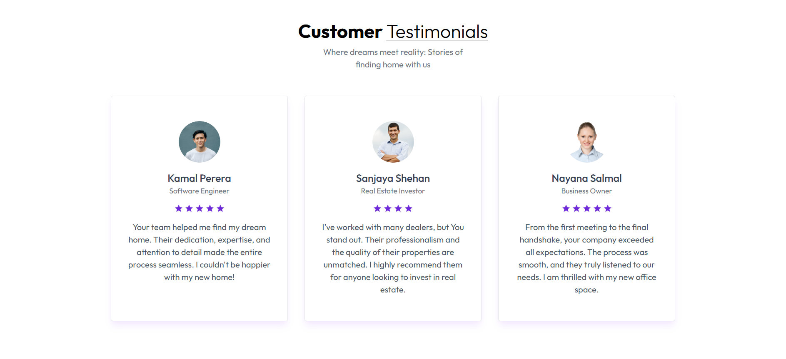

 </br>
_A Sleek and Responsive Real Estate Application_

Welcome to **අපිලගෙ ගෙදර**, a modern and elegant real estate portfolio website. With seamless animations and stunning design, this application showcases the essence of your dream home through sections like **Home**, **About Us**, **Projects**, **Testimonials**, and **Contact Us**. Perfect for real estate businesses aiming to captivate audiences online.

---

## **🌟 Features**

- **Home**: A captivating hero section to make a strong first impression.  
- **About Us**: Highlights the brand's journey, values, and expertise in the real estate sector.  
- **Projects**: Displays completed and ongoing real estate projects with visual appeal.  
- **Testimonials**: Showcases feedback and success stories from happy clients.  
- **Contact Us**: An intuitive form and contact details for easy inquiries.  

---

## **🛠️ Technologies Used**

- **Frontend**: React, Javascript  
- **Styling**: Tailwind CSS  
- **Animations**: Framer Motion  
- **Build Tool**: Vite  
- **Icons**: [Icon8](https://icons8.com/)  
- **Fonts**: Google Fonts  
- **Design Assets**: Canva  

---

## **📸 Screenshots**

### **Web View**
<table>
  <tr>
    <td></td>
    <td></td>
  </tr>
  <tr>
    <td></td>
    <td></td>
  </tr>
</table>


> **Note**: Screenshots are in the `images` folder in project directory.

---

## **🚀 Installation & Usage**

1. **Clone the repository :**  
   ```bash
   git clone https://github.com/AminduBhashana/real_estate_web_react_tailwind.git
   cd real_estate_web_react_tailwind

2. **Install dependencies :**  
   ```bash
   npm install

3. **Start the development server :**  
   ```bash
   npm run dev

4. **Start the development server :**
   Navigate to `http://localhost:5173`

### 🌟 Thank You for Exploring **අපිලගෙ ගෙදර**!

